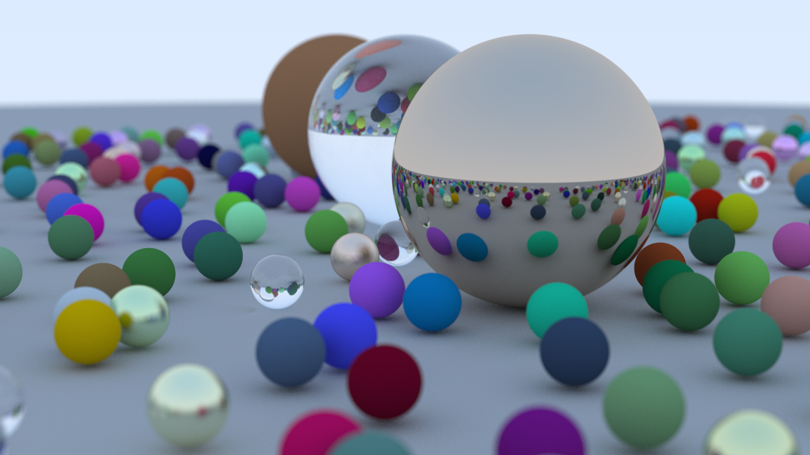
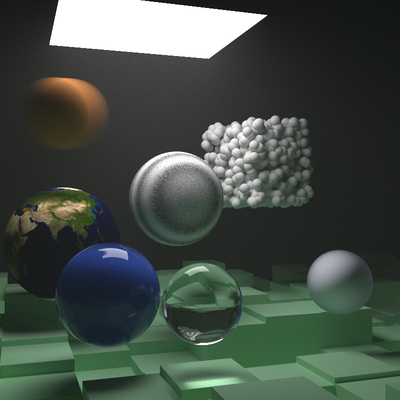
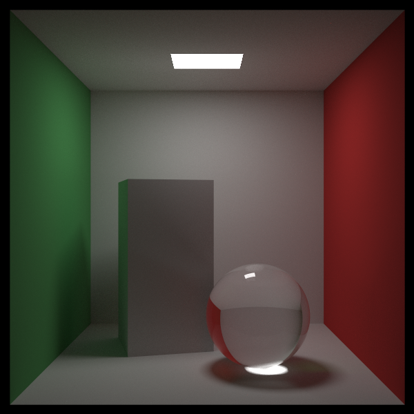

# ray-tracing-in-one-weekend-study
A physically based path tracer implemented in C++ from scratch. Based on Peter Shirley's "Ray Tracing in One Weekend," featuring Lambertian, Metal, and Dielectric materials with defocus blur.

This project is based on the book [_Ray Tracing in One Weekend_](https://raytracing.github.io/books/RayTracingInOneWeekend.html)

